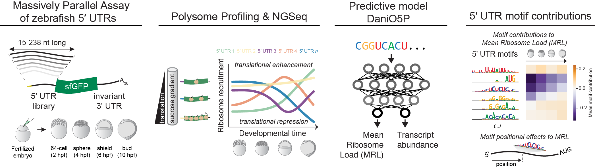

# DaniO5P: Predicting 5'UTR-mediated translation during zebrafish embryogenesis

This repository contains code to train, evaluate, and interpret the Danio Optimus 5-Prime (DaniO5P) model from [Reimão-Pinto MM, Castillo-Hair SM, Seelig G, Schier A. *The regulatory landscape of 5′ UTRs in translational control during zebrafish embryogenesis.* bioRxiv 2023](https://www.biorxiv.org/content/10.1101/2023.11.23.568470v1).

## Contents
See Python scripts and Jupyter notebooks inside each folder for more details.

### DaniO5P examples
- [`example_DaniO5P.ipynb`](example_DaniO5P.ipynb): Example jupyter notebook on how to use DaniO5P to make predictions on an arbitrary 5'UTR sequence.
- [`example_plot_contributions.ipynb`](example_plot_contributions.ipynb): Example jupyter notebook on how to plot precomputed predictions and contribution scores for any sequence in the MPRA.

### DaniO5P model training
- [`length_model`](length_model): Calculate and evaluate a model on Mean Ribosome Load (MRL) and estimated changes in abundance only based on 5'UTR length. Compute predictions and residuals (measurements - predictions) for all MPRA sequences.
- [`cnn`](cnn): Train and evaluate an ensemble of convolutional neural network (CNN) models to predict the residuals of MRL and estimated changes in abundance based on sequence.
- [`full_model_evaluation`](full_model_evaluation): Compute performance metrics on the full DaniO5P (length + CNN) model, which are reported in the manuscript.

### DaniO5P interpretation
- [`contributions`](contributions): Calculate nucleotide contributions to MRL and abundance predictions, for every sequence in the MPRA. Generate nucleotide contribution plots for the paper figures.
- [`motifs`](motifs): Extract motifs from the convolutional filters of the CNN models. Calculate average motif contributions to MRL and estimated changes in abundance at each timepoint, and relate these to motif position, secondary structure, etc.

### Preprocessing and supporting code
- [`preprocess_data`](preprocess_data): Data preprocessing. Computes MRL and estimated abundances from fraction TPMs, which are used for model training and analysis.
- [`secondary_structure`](secondary_structure): Computes secondary structure metrics such as free energy and unpaired probabilities. These are used for motif analysis.
- [`utils`](utils): Supporting code for sequence processing, model interpretation, and plotting.

## Additional data

Some files are too big to be included in this repository. The following must be downloaded separately:

- Trained model weights: [TODO: add URL when available]
- Calculated contribution scores for all MPRA sequences: [TODO: add URL when available]
- Secondary structure calculation results: [TODO: add URL when available]

## Requirements
All of the code here was run in Python 3.9 with the following package version:
- `matplotlib` 3.5.1
- `numpy` 1.26.4
- `pandas` 1.4.3
- `scipy` 1.12.0
- `seaborn` 0.13.2
- `logomaker` 0.8
- `tensorflow` 2.7
- `nupack` 4.0.1.1 (for secondary structure calculations)
- `prtpy` 0.8.2 (to compute chromosome-based data splits)

Other necessary software includes:
- The DeepSHAP version at https://github.com/castillohair/shap/tree/castillohair/genomics_mod commit # f77513e2e05eb63f4d3b17ec9f9d3569c930ad02 for the code in `contributions`. Adapted from the [Kundaje lab fork](https://github.com/kundajelab/shap) to work with tensorflow 2.
- A modified version of `matrix-clustering` at https://github.com/castillohair/matrix-clustering_stand-alone, original from https://github.com/jaimicore/matrix-clustering_stand-alone, for the code in `motifs`.

